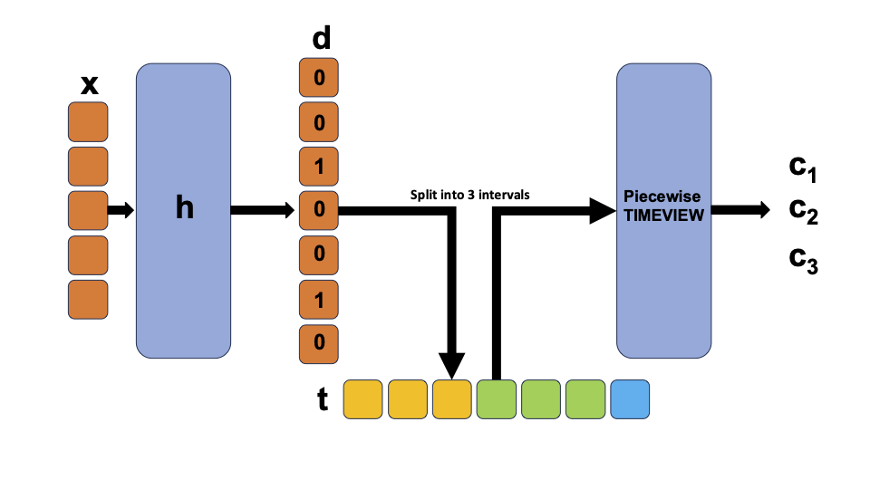

# Discontinuous TIMEVIEW

Repo for the **2 weeks** project for PhD application at [van der Schaar Lab](https://www.vanderschaar-lab.com/prof-mihaela-van-der-schaar/). The report can be found here [report](assets/When_continuous_is_not_the_question.pdf). 

## Architecture 

Discontinuous TIMEVIEW architecture. The block **h** is an encoder that maps the input vector **x** into timestamps in which jump discontinuities will appear.
